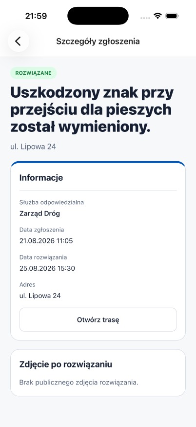
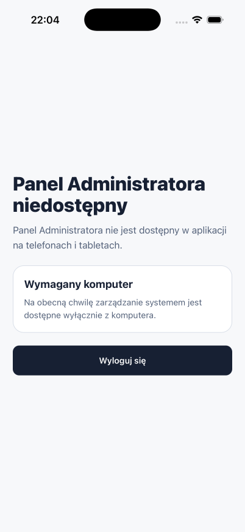

# ZgłosTO Mobile

Ten katalog zawiera uruchamialną aplikację natywną ZgłosTO dla iOS i Androida oraz
dokumentację jej wdrożenia. Aplikacja korzysta z Expo SDK 57, React Native 0.86,
Expo Router i lokalnych development buildów. Obsługuje publiczny feed, mieszkańca,
służbę terenową oraz jawną blokadę roli administratora w Mobile 1.0.

## Prezentacja

<table>
  <tr>
    <td></td>
    <td></td>
    <td></td>
  </tr>
</table>

- [pełna galeria i zasady prywatności screenshotów](docs/screenshots/README.md);
- [krótki scenariusz prezentacyjny](SHOWCASE_DEMO.md);
- [powtarzalny Quick Start](QUICK_START.md);
- [wynik kroku 7.4](PHASE_7_4_VERIFICATION.md);
- [regresja Android/iOS](PHASE_7_6_VERIFICATION.md);
- [przekazanie klientowi](CLIENT_HANDOFF.md);
- [checkpoint Fazy 7](PHASE_7_CHECKPOINT.md).

Wszystkie widoczne konta, incydenty, adresy i współrzędne są syntetyczne. Materiały nie
oznaczają gotowości do sklepów ani wdrożenia produkcyjnego.

## Architektura rozwiązania

Klient Mobile został zbudowany greenfield w obecnym monorepo, z Expo Router i lokalnymi
buildami Expo. Mobile współdzieli kod niezależny od platformy:

- `@zglosto/contracts` — typy, parsery Zod, statusy, role i limity;
- `@zglosto/i18n` — katalogi `pl-PL` i `en` oraz formatowanie;
- publiczny kontrakt White-Label;
- semantykę kluczy TanStack Query i reguły domenowe, po wydzieleniu ich z webowych
  adapterów.

Nie należy współdzielić:

- komponentów DOM z `frontend/src/components`;
- wrapperów shadcn/Base UI;
- routingu TanStack Router;
- kodu zależnego od `window`, `document`, `localStorage`, przeglądarkowego `File`,
  `crypto.subtle` i automatycznych cookies.

Szczegółowe uzasadnienie znajduje się w [MIGRATION.md](MIGRATION.md), a docelowy
podział kodu w [ARCHITECTURE.md](ARCHITECTURE.md).

## Licencja, bezpieczeństwo i współtworzenie

Mobile jest częścią monorepo ZgłosTO i podlega tym samym zasadom co WEB, backend oraz
infrastruktura. Jedynymi źródłami prawdy są dokumenty w katalogu głównym:

- [LICENSE](../LICENSE) — PolyForm Internal Use License 1.0.0;
- [SECURITY.md](../SECURITY.md) — prywatne zgłaszanie podatności i wspierane wersje;
- [CONTRIBUTING.md](../CONTRIBUTING.md) — Issues, pomysły, PR, jakość i zasady danych;
- [CLA.md](../CLA.md) — warunki przyjmowania zewnętrznego wkładu;
- [szablon pull requesta](../.github/pull_request_template.md) — wspólna checklista zmian.

Nie tworzymy kopii tych plików w `Mobile/`. Niewrażliwe błędy i pomysły są zgłaszane przez
GitHub Issues, większe zmiany najpierw omawiane w issue, a podatności wyłącznie prywatnym
kanałem opisanym w `SECURITY.md`. Publiczne repozytorium pozostaje source-available i nie
staje się przez samą publikację projektem open source.

## Zakres tego pakietu

| Plik                      | Rola                                                        |
| ------------------------- | ----------------------------------------------------------- |
| `CURRENT_STATE.md`        | kanoniczny snapshot i punkt wznowienia prac                 |
| `CLIENT_HANDOFF.md`       | odbiór kodu i droga od repozytorium do produkcji            |
| `QUICK_START.md`          | powtarzalne lokalne demo dla oceniającego i klienta         |
| `CLIENT_CONFIGURATION.md` | dane i procedura nowego wariantu White-Label                |
| `SHOWCASE_DEMO.md`        | krótki scenariusz prezentacji produktu                      |
| `docs/screenshots/`       | zanonimizowana galeria iOS/Android                          |
| `MIGRATION.md`            | rekomendacja, dowody, ograniczenia i checkpoint             |
| `ARCHITECTURE.md`         | docelowa architektura i planowana struktura projektu        |
| `VIEW_AUDIT.md`           | audyt istniejących widoków i sposób ich adaptacji do mobile |
| `API_AND_AUTH.md`         | kontrakt API, sesji, zdjęć i konfiguracji                   |
| `ROADMAP.md`              | fazy wdrożenia i bramki jakości                             |
| `READINESS_CHECKLIST.md`  | przygotowanie Maca, platform, kont i środowisk              |
| `PARITY_CHECKS.md`        | scenariusze parytetu na urządzeniach                        |
| `RISKS_AND_DECISIONS.md`  | rejestr ryzyk, założeń i decyzji otwartych                  |
| `SCREENS.tsv`             | inwentarz ekranów, ról i priorytetów                        |
| `STATE_AND_STORAGE.tsv`   | mapa stanu, cache i bezpiecznego storage                    |
| `DEPENDENCIES.tsv`        | plan zależności i zamienniki webowych API                   |
| `EVENTS.tsv`              | roboczy kontrakt analityki bez danych osobowych             |
| `OWNERS.tsv`              | wymagane odpowiedzialności i stan przypisania               |

## Najważniejsze ustalenia

Bieżący wynik, aktywne ograniczenia i następny etap są zapisane w
[CURRENT_STATE.md](CURRENT_STATE.md). Po przerwie należy zacząć od tego dokumentu.

1. Pierwszy checkpoint ma udowodnić trzy pionowe przepływy:
   publiczną listę i szczegóły, logowanie z historią mieszkańca oraz zgłoszenie ze
   zdjęciem i późniejszą aktualizację przez służbę.
2. Auth pozostaje oparty na Better Auth. Mobile przechowuje cookie przez oficjalną
   integrację Expo/SecureStore i jawnie przekazuje je do API.
3. Formularz zgłoszenia pozostaje początkowo jednym przepływem o tej samej semantyce
   co web. Podział na kroki można rozważyć dopiero po teście użyteczności.
4. UI jest implementowane natywnie. Dialogi webowe stają się ekranami stosu,
   modalami lub form sheetami, a długie listy używają wirtualizacji.
5. Role są rozłączne w Mobile 1.0: mieszkaniec i służba mają wyłącznie własne części,
   a administrator widzi komunikat o wymaganym komputerze oraz wylogowanie, bez linku WEB.
6. Push, geokodowanie, pełny tryb offline i edycja konfiguracji miasta nie należą do
   pierwszego wydania, dopóki backend i wymagania produktowe ich nie zdefiniują.

## Uruchamianie lokalne

Najkrótsza, izolowana ścieżka demonstracyjna jest opisana w
[QUICK_START.md](QUICK_START.md):

```bash
pnpm mobile:demo:check
pnpm mobile:demo:up
pnpm mobile:demo:ios # albo mobile:demo:android
```

Z katalogu głównego monorepo:

```bash
pnpm --dir Mobile ios
pnpm --dir Mobile android
NODE_OPTIONS=--dns-result-order=ipv4first pnpm --dir Mobile dev --lan
```

Pierwsze dwie komendy wykonują lokalny prebuild, kompilują development clienta i
instalują go w uruchomionym symulatorze/emulatorze. Trzecia uruchamia Metro dla już
zainstalowanego development clienta przez adres LAN MacBooka. Tryb `--localhost`
na tej maszynie wiąże Metro wyłącznie z IPv6 i nie działa z iPhone Simulator.
Buildy EAS i publikacja sklepowa nie są obecnie częścią procesu.

Faza 2 wymaga jawnej konfiguracji publicznego originu. Dla lokalnego backendu lub
kontrolowanego fixture:

```bash
EXPO_PUBLIC_APP_ENV=development \
EXPO_PUBLIC_ALLOW_HTTP_ORIGIN=true \
EXPO_PUBLIC_API_ORIGIN=http://127.0.0.1:1235 \
NODE_OPTIONS=--dns-result-order=ipv4first \
pnpm --dir Mobile dev --localhost
```

Android Emulator używa `http://10.0.2.2:1235` zamiast `127.0.0.1`. Dla Metro
pozostającego na loopback należy wykonać `adb reverse tcp:8081 tcp:8081`. Flaga
`NODE_OPTIONS` jest potrzebna na tym Macu, ponieważ Expo Dev Launcher 57 nie
akceptuje poprawnie adresu inspectora z literalnym IPv6 `::1`.

Po dodaniu lub aktualizacji modułu natywnego trzeba ponownie wykonać `ios` i
`android`; samo ponowne uruchomienie Metro nie przebudowuje CocoaPods ani Gradle.

Podstawowe bramki jakości:

```bash
pnpm --dir Mobile quality
pnpm --dir Mobile build
npx -y react-doctor@latest Mobile --no-telemetry --verbose
pnpm check
```

Opcjonalna, lokalna regresja po uruchomieniu demo i Metro:

```bash
AGENT_DEVICE_PLATFORM=android AGENT_DEVICE_DEVICE='Pixel 9' pnpm mobile:regression
AGENT_DEVICE_PLATFORM=ios AGENT_DEVICE_DEVICE='iPhone 17 Pro' pnpm mobile:regression
```

Wymaga `agent-device`; podstawowy Quick Start nie wymaga tego narzędzia.

Wyniki wdrożenia i smoke testów Fazy 2 znajdują się w
[PHASE_2_VERIFICATION.md](PHASE_2_VERIFICATION.md).

Wyniki bramki HTTPS i testów urządzeń Fazy 3.0 znajdują się w
[PHASE_3_0_VERIFICATION.md](PHASE_3_0_VERIFICATION.md).

Implementacja publicznego feedu i szczegółów z kroku 3.1 jest opisana w
[PHASE_3_1_VERIFICATION.md](PHASE_3_1_VERIFICATION.md).

Implementacja sesji Better Auth, logowania mieszkańca i wylogowania z kroku 3.2
jest opisana w [PHASE_3_2_VERIFICATION.md](PHASE_3_2_VERIFICATION.md).

Implementacja prywatnej historii zgłoszeń mieszkańca z kroku 3.3 jest opisana w
[PHASE_3_3_VERIFICATION.md](PHASE_3_3_VERIFICATION.md).

Implementacja utworzenia zgłoszenia bez zdjęcia z kroku 3.4 jest opisana w
[PHASE_3_4_VERIFICATION.md](PHASE_3_4_VERIFICATION.md).

Implementacja wyboru zdjęcia, checksum i presigned uploadu z kroku 3.5 jest opisana
w [PHASE_3_5_VERIFICATION.md](PHASE_3_5_VERIFICATION.md).

Implementacja prywatnych obrazów i kontrolowanego cache z kroku 3.6 jest opisana w
[PHASE_3_6_VERIFICATION.md](PHASE_3_6_VERIFICATION.md).

Implementacja kolejki, mutacji i zdjęcia rozwiązania służb z kroku 3.7 jest opisana
w [PHASE_3_7_VERIFICATION.md](PHASE_3_7_VERIFICATION.md).

Bezpieczne custom deep linki i kontrakt Universal/App Links z kroku 3.8 opisuje
[PHASE_3_8_VERIFICATION.md](PHASE_3_8_VERIFICATION.md), a pełny kontrakt aktywacji
domeny znajduje się w [APP_LINK_CONTRACT.md](APP_LINK_CONTRACT.md).

Checkpoint Fazy 3 zakończył się decyzją **CONTINUE**. Macierz i przeniesione bramki
beta/release opisują [PHASE_3_9_VERIFICATION.md](PHASE_3_9_VERIFICATION.md) oraz
[PHASE_3_ACCEPTANCE.tsv](PHASE_3_ACCEPTANCE.tsv).

Zakres i kontrakt akceptacyjny rozpoczęcia MVP mieszkańca opisuje
[PHASE_4_0_BASELINE.md](PHASE_4_0_BASELINE.md). Lokalny przepływ weryfikacji e-mail
używa nakładki `docker-compose.phase4.local.yml`; nie wysyła prawdziwych wiadomości.
Implementację i dowody rejestracji, resend oraz callbacku zawiera
[PHASE_4_1_VERIFICATION.md](PHASE_4_1_VERIFICATION.md).
Konto i język opisuje [PHASE_4_2_VERIFICATION.md](PHASE_4_2_VERIFICATION.md), a
kontakt i informacje prawne [PHASE_4_3_VERIFICATION.md](PHASE_4_3_VERIFICATION.md).
Końcowy wynik MVP mieszkańca opisują
[PHASE_4_CHECKPOINT.md](PHASE_4_CHECKPOINT.md) i
[PHASE_4_ACCEPTANCE.tsv](PHASE_4_ACCEPTANCE.tsv).
Baseline rozpoczęcia MVP służb znajduje się w
[PHASE_5_0_BASELINE.md](PHASE_5_0_BASELINE.md), a jego dane i macierz w
[PHASE_5_TEST_DATA.tsv](PHASE_5_TEST_DATA.tsv) oraz
[PHASE_5_ACCEPTANCE.tsv](PHASE_5_ACCEPTANCE.tsv). Wynik routingu służby i kolejki
opisuje [PHASE_5_1_2_VERIFICATION.md](PHASE_5_1_2_VERIFICATION.md).

## Status

- analiza repozytorium: zakończona;
- analiza źródeł widoków: zakończona;
- przegląd w przeglądarce: częściowy — zweryfikowano shell i stan błędu, ale lokalny
  backend/auth nie był uruchomiony;
- implementacja Expo: bootstrap SDK 57 gotowy;
- fundament Fazy 2: API, cache White-Label, TanStack Query, NativeWind v4, i18n,
  theme, granice routingu i logger z allowlistą zaimplementowane;
- Faza 3.1: publiczny feed, karta, szczegóły, mapy i publiczne zdjęcie rozwiązania
  zaimplementowane; lista zweryfikowana na iOS i Androidzie, szczegóły na Androidzie;
- Faza 3.2: klient Better Auth Expo, SecureStore, logowanie mieszkańca, trwałość
  sesji po restarcie, czyszczenie prywatnego cache i wylogowanie zaimplementowane;
  pełny przepływ zweryfikowany na Androidzie, a build, API i ekran logowania na iOS;
- Faza 3.3: prywatna historia mieszkańca, walidacja kontraktu, statusy, pull-to-refresh
  i czyszczenie cache zaimplementowane; pełny przepływ oraz cold restart zaliczone
  na Androidzie, aktualny bundle i API zweryfikowane na iOS;
- Faza 3.4: formularz anonimowy/mieszkańca bez zdjęcia, walidacja, wybór służby,
  obsługa mutacji i invalidacja historii zaimplementowane; pełny zapis `201` i ekran
  sukcesu zaliczone na Androidzie, aktualny modal i bundle zweryfikowane na iOS;
- Faza 3.5: biblioteka/aparat, preview, walidacja 5 MiB/MIME, SHA-256, presigned PUT,
  postęp, cancel i retry zaimplementowane; pełny zapis ze zdjęciem i przetworzenie
  workera zaliczone na Androidzie, finalny build i uprawnienia zweryfikowane na iOS;
- Faza 3.6: prywatne szczegóły, autoryzowany download obrazu, kontrolowany cache i
  jego czyszczenie zaimplementowane; oba obrazy oraz cleanup zaliczone na Androidzie,
  finalny build zweryfikowany na iOS;
- Faza 3.7: kolejka służb, liczniki, filtry, szczegóły, status, weryfikacja i zdjęcie
  rozwiązania zaimplementowane; UI obu ról zaliczone na Androidzie, mutacje/upload
  potwierdzone przez API, a finalny build zweryfikowany na iOS;
- Faza 3.8: bezpieczne custom deep linki, role-aware login intent, callback
  weryfikacji oparty na stanie serwera i warunkowa konfiguracja App Links
  zaimplementowane; ścieżki publiczne i błędne sprawdzone na Androidzie oraz iOS;
- Faza 3.9: lokalny checkpoint zakończony decyzją **CONTINUE**; pełne prywatne
  scenariusze iOS są bramką przed betą, a domena i fallback web przed release;
- Faza 4.0: zakres MVP mieszkańca, semantyka rejestracji/weryfikacji oraz lokalny
  kontrakt testowy zamrożone;
- Faza 4.1: formularz rejestracji, automatyczna sesja, resend oraz stan
  niezweryfikowanego e-maila zaimplementowane; pełny przepływ przeszedł na
  Androidzie, a finalny formularz i callback zweryfikowano na iOS;
- Faza 4.2: konto mieszkańca, diagnostyka i trwałe ustawienia PL/EN wdrożone;
  konto i cold restart języka zaliczone na Androidzie, język zweryfikowany na iOS;
- Faza 4.3: kontakt oraz komunikat prawny z White-Label wdrożone na obu platformach;
  zatwierdzone źródło regulaminu i polityki prywatności pozostaje bramką przed betą;
- Faza 4.4: komplet stanów danych, jawny cache offline i reconnect wdrożone bez
  niejawnej kolejki mutacji; prawdziwy offline oraz draft po reconnect zaliczone na
  Androidzie, a regresja feedu i formularza na iOS;
- Faza 4.5: role i stany kontrolek, dostępne błędy, duży tekst i reduce motion
  wdrożone; accessibility tree/TalkBack sprawdzone na Androidzie, maksymalny
  Dynamic Type na iOS, a ręczny odsłuch screen readerów pozostaje bramką przed betą;
- Faza 4: zakończona lokalnie decyzją **CONTINUE**; wspólny test Maestro przechodzi
  na iPhone 17 Pro Simulator i Pixel 9 Android Emulator, a mapa danych i manifest
  prywatności pokrywają aktualne zachowanie aplikacji;
- Faza 5.0: zamrożono kontrakt roli służby, `serviceKey`, filtrów i błędów,
  zdefiniowano fixture E2E/wydajności oraz ujawniono brak backendowego warunku
  wersji potrzebnego do wiarygodnego `409`;
- Faza 5.1–5.2: routing i zakres służby, cleanup przy zmianie sesji, kolejka,
  liczniki, filtry, cache offline i reconnect zakończone na Pixelu 9 oraz iPhonie
  17 Pro z iOS 26.5;
- Faza 5.3–5.6: szczegóły, mutacje, zdjęcie rozwiązania, kontrola rewizji `409`,
  słaba sieć oraz izolacja prywatnych zakresów zakończone na obu platformach;
- Faza 5.7–5.9: dostępność i ergonomia, pomiar fixture LOAD-A oraz pełny przepływ
  terenowy zakończone decyzją **PASS / CONTINUE**; pozostaje `FlatList`, a testy
  fizycznych urządzeń i ręczny odsłuch screen readerów są bramkami przed betą —
  [PHASE_5_7_9_VERIFICATION.md](PHASE_5_7_9_VERIFICATION.md);
- Faza 6.0: wersja 1.0 otrzymała rozłączne granice ról; służba korzysta wyłącznie
  ze swojego panelu, a administrator widzi w Mobile tylko komunikat o wymaganym
  komputerze i wylogowanie, bez linku WEB —
  [PHASE_6_0_ROLE_BOUNDARIES.md](PHASE_6_0_ROLE_BOUNDARIES.md);
- integracja z PNPM/Turborepo: gotowa; `build`, `test` i `typecheck` obejmują Mobile;
- minimalne systemy: iOS/iPadOS 17.0 oraz Android 12 / API 31;
- zakres pierwszego wydania: panel mieszkańca i panel służb; admin poza v1;
- buildy: lokalne i wykonywane osobno dla każdej instancji klienta;
- analityka: wyłączona i bez zainstalowanego SDK;
- weryfikacja bootstrapu: iOS build succeeded, Android build successful,
  Expo Doctor 21/21 i React Doctor 100/100 (2026-08-19);
- weryfikacja Fazy 2: działający ekran na iPhone 17, iPad Pro 11″ i Pixel 9;
  cold start z cache oraz rewalidacja `304` sprawdzone; Expo Doctor 21/21,
  React Doctor 0 błędów i pełne `pnpm check` zaliczone 2026-08-19;
- wersja workspace: `1.0.0`, wspólna z bazowym wydaniem repozytorium; nie oznacza to
  opublikowania aplikacji w App Store ani Google Play;
- gotowość konkretnego hosta jest weryfikowana osobno dla instancji klienta;
- decyzja checkpointu: Faza 7 jest zamknięta ze statusem
  `SOURCE READY / CLIENT-BUILT / NOT STORE-PUBLISHED`;
- wspólna licencja, SECURITY, CONTRIBUTING, CLA i proces zmian obejmują cały produkt;
  hosting, signing i ewentualna dystrybucja sklepowa należą do klienta.
- Faza 7.4: profesjonalny seed demo, scenariusz prezentacyjny, zanonimizowany asset oraz
  sześć screenshotów iOS/Android przygotowane; główny README przebudowany jako materiał
  produktowo-techniczny — [PHASE_7_4_VERIFICATION.md](PHASE_7_4_VERIFICATION.md).
