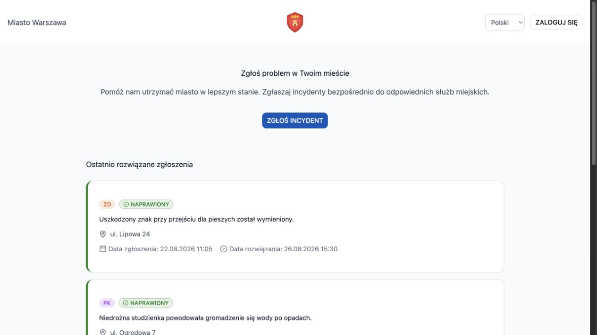
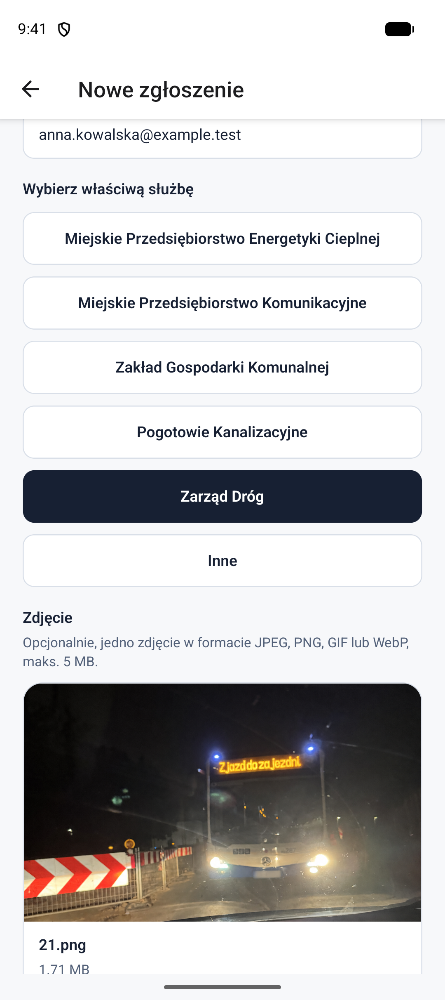
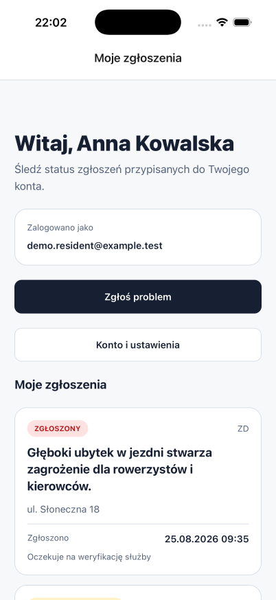
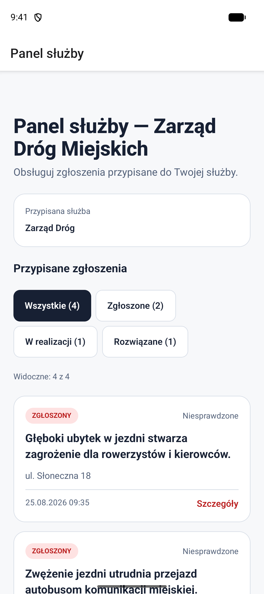
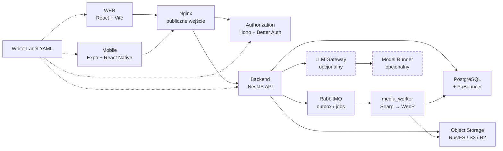

<p align="center">
  
</p>

<h1 align="center">ZgłosTO</h1>

<p align="center">
  <strong>Od zauważonego problemu do zamkniętej sprawy.</strong><br>
  Konfigurowalna platforma, która łączy mieszkańców z miejskimi służbami.
</p>

<p align="center">
  <a href="#szybki-start">Szybki start</a> ·
  <a href="#produkt-w-praktyce">Produkt</a> ·
  <a href="#szkic-architektury">Architektura</a> ·
  <a href="docs/local-development.md">Pełna instrukcja</a>
</p>

<p align="center">
  
  
</p>

## TechStack

### Badge’e

**WEB + Mobile**

<p align="center">
  
  
  
  
  
  
  
</p>

**Kontrakty + API**

<p align="center">
  
  
  
  
  
</p>

**Dane + infrastruktura + jakość**

<p align="center">
  
  
  
  
  
  
  
  
  
</p>

### Technologie i odpowiedzialność

| Warstwa          | Technologie                                                                                                            | Odpowiedzialność                                                       |
| ---------------- | ---------------------------------------------------------------------------------------------------------------------- | ---------------------------------------------------------------------- |
| **WEB**          | React, Vite, TanStack Router/Start, TanStack Query, Base UI, shadcn/ui, Tailwind CSS                                   | Publiczny feed, formularze, panele mieszkańca, służby i administratora |
| **Mobile**       | Expo, React Native, Expo Router, NativeWind, TanStack Query, SecureStore, NetInfo                                      | iOS/Android z bezpieczną sesją                                         |
| **Kontrakty**    | TypeScript, Zod, <code>@zglosto/contracts</code>, <code>@zglosto/i18n</code>, <code>@zglosto/white-label-config</code> | Wspólne typy i walidacja konfiguracji                                  |
| **API i auth**   | Node.js, NestJS, Hono, Better Auth                                                                                     | API domenowe, sesje, role, rate limiting i integracje                  |
| **Dane i media** | PostgreSQL, PgBouncer, RabbitMQ, Sharp, S3-compatible storage                                                          | Dane domenowe, kolejki, backup, zdjęcia i przetwarzanie obrazów        |
| **Uruchomienie** | Docker Compose, Nginx, Kubernetes/K3s, Docker Model Runner                                                             | Lokalne demo, profile wdrożeniowe i opcjonalne AI                      |
| **Jakość**       | PNPM, Turborepo, Vitest, Oxc, React Doctor                                                                             | Monorepo, testy, format, linting i kontrola jakości                    |

> **Status projektu:** **Source Ready / Client-Built / Not Store-Published**. Repozytorium
> dostarcza działający kod WEB, Mobile i usług backendowych. Każda instancja klienta
> uruchamia własną konfigurację miasta i buduje własne binarki; wspólna aplikacja
> nie jest publikowana w App Store ani Google Play.

## Czym jest ZgłosTO?

ZgłosTO to gotowa baza produktu White-Label dla miasta, gminy albo operatora usług
publicznych. Mieszkaniec może zgłosić problem ze zdjęciem, zobaczyć jego status i wrócić
do historii swoich spraw. Właściwa służba otrzymuje uporządkowaną kolejkę, może filtrować
zgłoszenia i zamknąć sprawę, dokumentując rozwiązanie.

Jedna baza kodu może obsługiwać wiele niezależnych wdrożeń. Każdy deployment reprezentuje
jedno miasto i ma własny branding, katalog służb, bazę danych, storage, sekrety oraz
środowisko uruchomieniowe.

## Dlaczego ten produkt?

| Dla kogo              | Co dostaje                                                                            |
| --------------------- | ------------------------------------------------------------------------------------- |
| **Mieszkaniec**       | Publiczny feed rozwiązanych spraw, formularz zgłoszenia, zdjęcia, historię i statusy. |
| **Służba miejska**    | Własną kolejkę spraw, filtry, szczegóły, weryfikację oraz zdjęcie rozwiązania.        |
| **Administrator**     | Pełny panel WEB do obsługi danych i zarządzania użytkownikami.                        |
| **Operator / miasto** | Branding, języki, kontakt, teksty prawne i katalog usług z jednego kontraktu YAML.    |

Role są rozdzielone po stronie routingu klienta i backendu. Konto służby widzi wyłącznie
zakres przypisanej służby, a administrator w Mobile 1.0 otrzymuje jasny komunikat
o konieczności skorzystania z komputera — bez bocznej furtki do panelu WEB.

## Produkt w praktyce

### WEB

<p align="center">
  
</p>

<p align="center">
  <sub>Publiczny widok WEB z lokalnego demo. Dane, adresy i zgłoszenia są syntetyczne.</sub>
</p>

### Mobile

<table>
  <tr>
    <td align="center" width="33%">
      
      <br><sub>Zgłoszenie ze zdjęciem</sub>
    </td>
    <td align="center" width="33%">
      
      <br><sub>Historia mieszkańca</sub>
    </td>
    <td align="center" width="33%">
      
      <br><sub>Kolejka służby</sub>
    </td>
  </tr>
</table>

## Najważniejsze możliwości

### Zgłaszanie i obsługa spraw

- zgłoszenia anonimowe albo powiązane z kontem mieszkańca;
- opis, adres i opcjonalne zdjęcie z walidacją typu, rozmiaru i checksumy;
- statusy <code>zgłoszone</code>, <code>w trakcie</code> i <code>naprawione</code>;
- publiczny feed rozwiązanych spraw oraz prywatna historia użytkownika;
- kolejka służby filtrowana po stabilnym kluczu usługi;
- zdjęcie rozwiązania i bezpieczne pobieranie prywatnych obrazów.

### White-Label

Konfiguracja miasta jest wersjonowanym plikiem YAML walidowanym przez strict schema
Zod przy starcie. Obejmuje między innymi:

- nazwę miasta, logo, kolory i favicon;
- języki <code>pl-PL</code> oraz <code>en</code>;
- katalog aktywnych służb i ich skróty;
- kontakt, godziny pracy, stopkę i komunikaty prawne;
- feature flags, fallback routingu oraz ustawienia mapy.

### Prywatność i odporność

- Better Auth, SecureStore na Mobile i jawne granice ról;
- presigned upload do prywatnego storage zamiast przesyłania pliku przez kolejkę;
- osobny worker Sharp konwertujący zdjęcia do WebP i usuwający oryginał po przetworzeniu;
- PostgreSQL outbox + RabbitMQ z retry/DLQ dla zadań asynchronicznych;
- TLS/mTLS między usługami, sekrety poza obrazami i repozytorium;
- opcjonalny LLM z krótkim timeoutem i bezpiecznym fallbackiem — niedostępny model
  nie blokuje zapisania zgłoszenia.

## Jak działa zgłoszenie?

1. Mieszkaniec opisuje problem w WEB albo Mobile i dołącza zdjęcie.
2. API zapisuje sprawę w PostgreSQL, a plik trafia jednorazowo do prywatnego storage.
3. Worker przetwarza obraz asynchronicznie; opcjonalny LLM pomaga skierować sprawę
   do właściwej służby, ale fallback ręczny pozostaje zawsze dostępny.
4. Służba obsługuje kolejkę, aktualizuje status i może dodać zdjęcie rozwiązania.
5. Mieszkaniec widzi zmianę w historii, a sprawa może trafić do publicznego feedu.

## Szkic architektury



Klienci korzystają wyłącznie z publicznego wejścia Nginx. Backend jest jedynym głównym
API domenowym; Authorization odpowiada za sesje i role, a worker nie wystawia publicznego
HTTP. Lokalnie storage dostarcza RustFS, ale kontrakt pozostaje kompatybilny z AWS S3,
Cloudflare R2 i innymi providerami S3-compatible.

## Szybki start

Trzy kroki uruchamiają pełny lokalny stack przez Docker Compose. Wymagany jest Node.js
<code>>=26.5</code>, PNPM <code>11.22.0</code> oraz Docker Desktop albo OrbStack.

```bash
# 1. Utwórz lokalną konfigurację
cp .env.example .env

# 2. Zainstaluj zależności i wygeneruj ignorowane certyfikaty dev
pnpm install --frozen-lockfile && pnpm certs:dev

# 3. Uruchom cały stack
docker compose up -d --build
```

Otwórz [http://localhost:1235](http://localhost:1235). Domyślny profil korzysta z
lokalnego RustFS, a Redis, LLM i obserwowalność pozostają wyłączone, dzięki czemu start
nie wymaga zewnętrznych usług ani kluczy API.

## Pełna instrukcja i dokumentacja

| Dokument                                                                     | Kiedy go otworzyć                                                                         |
| ---------------------------------------------------------------------------- | ----------------------------------------------------------------------------------------- |
| [Pełne uruchomienie lokalne](docs/local-development.md)                      | Środowisko, healthchecki, demo, profile Compose, testy, cleanup i troubleshooting         |
| [Quick Start Mobile](Mobile/QUICK_START.md)                                  | Izolowane demo iOS/Android z syntetycznymi kontami                                        |
| [Indeks dokumentacji](docs/README.md)                                        | Źródła prawdy, runbooki, handoffy i archiwum faz                                          |
| [Audyt architektury obecnej](docs/current-architecture-audit.md)             | To, co faktycznie działa w aktualnym runtime                                              |
| [Docelowa architektura White-Label](docs/target-white-label-architecture.md) | Kierunek rozwoju i granice usług                                                          |
| [Zmienne środowiskowe](docs/environment-variables.md)                        | ENV, sekrety i profile <code>disabled</code> / <code>local</code> / <code>external</code> |
| [Kubernetes / K3s](k8s/README_K8s.md)                                        | Wdrożenie poza pojedynczym hostem                                                         |

## Struktura repozytorium

```text
frontend/                 WEB — React, TanStack Router/Start, formularze i panele
Mobile/                   natywny klient Expo dla iOS i Androida
backend/                  główne API domenowe NestJS
authorization/            Better Auth, sesje i role
llm_gateway/              cienki adapter opcjonalnego modelu
packages/                 kontrakty, i18n, White-Label, storage transient i auth workload
database/                 PostgreSQL, migracje i backup/restore
nginx/                    publiczny reverse proxy i routing same-origin
config/white-label/       wersjonowana konfiguracja miasta
docs/                     dokumentacja operacyjna, architektura i release
```

## Stan projektu i licencja

Wersja workspace to <code>1.0.0</code>. Zakres pierwszego wydania obejmuje przepływy
mieszkańca i służb; panel administratora działa w WEB, natomiast Mobile zachowuje granicę
roli administratora. Konkretna instancja produkcyjna wymaga osobnej walidacji domeny HTTPS,
sekretów, backupów, monitoringu, signingów Mobile i procedury rollbacku.

ZgłosTO jest projektem source-available na warunkach
[PolyForm Internal Use License 1.0.0](LICENSE). Zasady współtworzenia i zgłaszania
podatności opisują [CONTRIBUTING.md](CONTRIBUTING.md), [CLA.md](CLA.md) oraz
[SECURITY.md](SECURITY.md).
